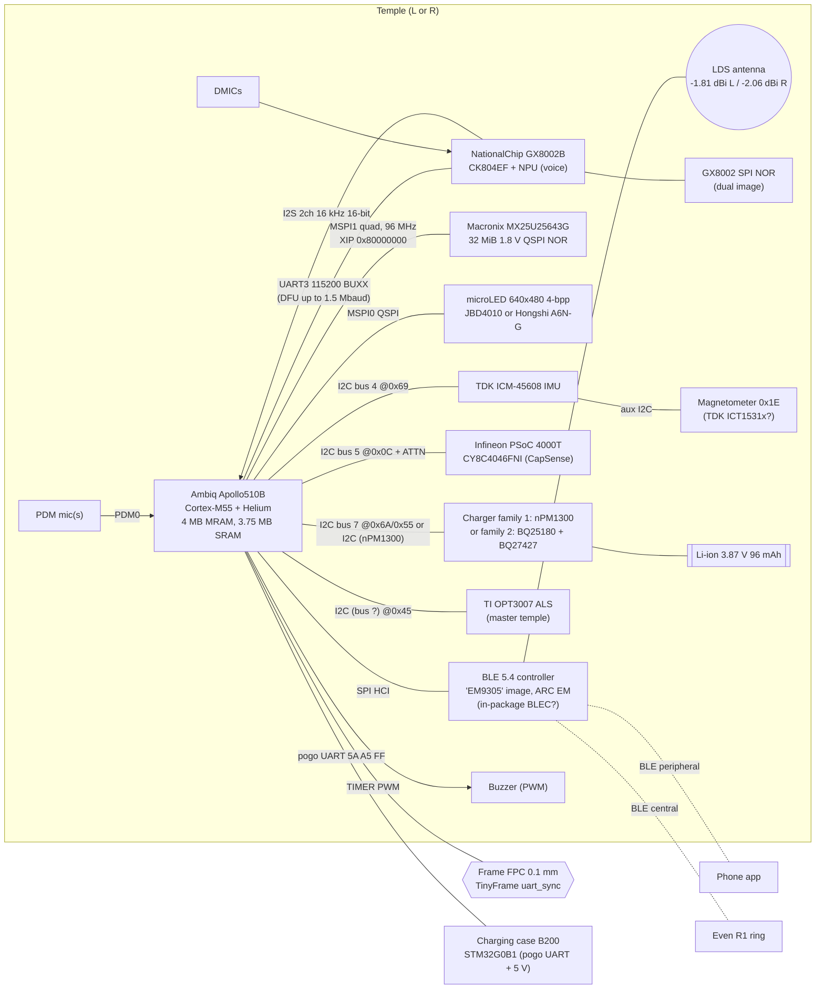
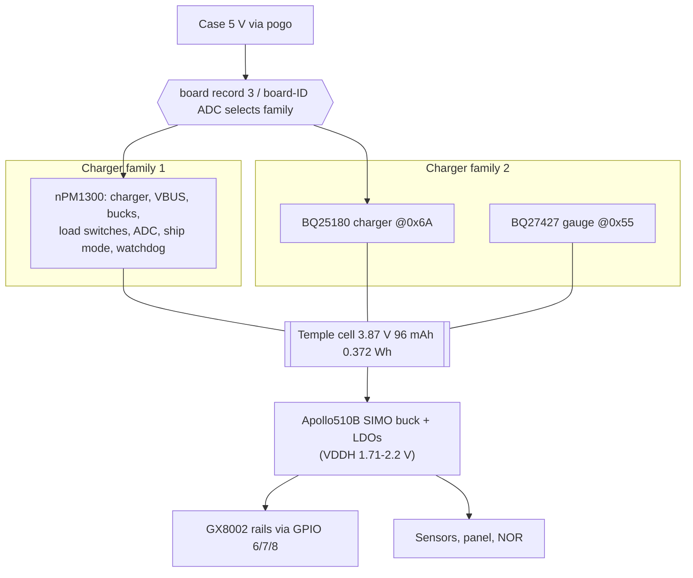

# Even G2 glasses: hardware

> **Citations.** Repository paths cited as `path` or `path:line` refer to the tree at commit `832137ec`. The 2026-09-29 cleanup retires many of those evidence files; after they are removed, `git show 832137ec:<path>` still shows them.

Tags follow the [confidence vocabulary](README.md#confidence-vocabulary):
FW, REG, DS, PR, COM, INF, UNV. Repository paths are relative to the
repository root. Run addresses in the Apollo main image are
`file_offset + 0x00437FE0`.

Internal names: glasses = **S200** (vendor build tree
`D:\01_workspace\s200_ap510b_iar_git\`, i.e. S200 + Apollo510B + IAR;
`g2/docs/research/g2-s200-board-config-recovery.md:4`) [FW]; the FCC antenna
housing is labelled "S200-L&R" [REG]; the case is **B200** [FW]. The G1
project code was S100 [REG, G1 label exhibit].

## 1. System overview

The G2 is two nearly independent computers, one in each temple tip. Each
temple has its own battery, its own Apollo510B running the same firmware
image, its own BLE radio and antenna, its own display panel and its own
peripheral set. The two temples are joined by a flexible circuit through the
frame.

| Statement | Tag | Evidence |
|---|---|---|
| Each temple has an Apollo510B with its own 4 MB MRAM and runs the same main image | FW (High) | `g2/docs/memory-map.md:23` ("Apollo510B internal MRAM — each temple"); one Apollo main payload in EVENOTA (`g2/tools/open_cfw.py:36-41`) |
| Each temple is its own BLE endpoint with its own name, `Even G2_32_L_xxxxxx` / `Even G2_32_R_xxxxxx` | FW, COM | `g2/docs/research/g2-advertised-name-serial-suffix.md`; g2flash `patches/mic_control.c` ("Each temple is its own Apollo510 and its own BLE endpoint") |
| Two independent BLE transmitters, L and R, each with its own LDS antenna | REG | G2 test report N25071003936E §4, §8.1 (L), §8.2 (R) |
| Temple tip holds antenna, processor and battery; a 0.1 mm "dual-sided communication FPC" runs through the frame, so left and right "no longer sync wirelessly" | PR (official blog) | https://www.evenrealities.com/blog/how-we-rebuilt-g2-from-the-inside-out |
| Temple identity is read from a hardware strap: five equal samples, value 1 ⇒ side id 2, else side id 1, mismatch ⇒ 3 (unavailable) | FW (Medium) | `g2/components/apollo_main/core_overlay/lens_side_policy.c` |
| Side id 1 = right temple = **master**; side id 2 = left temple. Only the master opens the ambient-light sensor and notifies the phone for some settings | COM | g2flash `patches/zlib_glue.c:184,203`, `patches/settings_ext.c:82,177`, `patches/als_sensor.c:11,307` (firmware 2.3.0.24) |
| The two temples run TinyFrame "uart_sync" with master and slave roles, plus a multipart `sync_framework` | FW (Medium) | `g2/docs/research/g2-uart-sync-recovery.md`; `g2/docs/research/g2-sync-framework-recovery.md:15` |
| The temple-to-temple link is a UART over the frame FPC | INF | FW shows a UART provider under TinyFrame; the official blog says the sides are wired, not wireless. Pads and baud not recovered. |
| Microphone audio to the phone comes from the right arm | G1 only, official | https://github.com/even-realities/EvenDemoApp (G1). Not established for G2. |

### Block diagram (one temple; both temples are the same unless noted)

## 2. Per-IC table

"Payload" is the EVENOTA component that carries the part's firmware
(`g2/tools/open_cfw.py:1168-1300`, `g2/docs/memory-map.md:7-21`).

| Part | Role | Bus / link | Address / ID | Interrupts | Pins / pads | Clock / data rate | Firmware payload | Evidence | Tag |
|---|---|---|---|---|---|---|---|---|---|
| **Ambiq Apollo510B** | Application MCU per temple: BLE host (Cordio), UI (LVGL + NemaGFX GPU), sensors, audio encode | — | Vector table `0x00438000`, SP `0x2007FB00`, reset `0x005E4233` | — | BGA 153 balls, 96 GPIO (DS) | Cortex-M55 up to 250 MHz (DS) | `ota/s200_firmware_ota.bin` (type 0), `ota/s200_bootloader.bin` (type 1) | `g2/docs/memory-map.md:23,302`; vendor path `s200_ap510b_iar_git`; press: https://www.electronicdesign.com/technologies/embedded/video/55404374/electronic-design-spot-helps-knock-down-edge-ai-noise ; COM: https://github.com/jimrandomh/g2flash | FW High, PR, COM |
| **BLE controller ("EM9305")** | BLE 5.4 link layer; host talks HCI | HCI over SPI (INF from datasheet), Ambiq "Apollo3-lineage" HCI driver, blocking, 8×260-B TX, 256-B RX, 10 s heartbeat | Vendor HCI: RF power `0xFCC4`, BD addr `0xFC43`, NVDS `0xFFF2` | GPIO group IRQ `GPIO0_607F` handler `0x004B80BE` in BLE-startup area (INF) | BLE_ENABLE = GPIO93 ball E5 if BLEC (DS) | ARC EM at 48 MHz (DS) | `firmware/ble_em9305.bin` (type 5) | `g2/docs/research/cordio-hci-driver-source-recovery.md`; `am_devices_em9305_init` string at run `0x0071F5D0` (`g2/docs/research/cordio-ble-stack-identity-audit.md:364`) | FW (image, HCI) High; physical form INF |
| **NationalChip GX8002B** ("grus") | Voice DSP + NPU: keyword spotting (LVP_KWS), VAD, beamforming, denoise | Control UART3; audio I2S to Apollo; power/reset GPIOs | Chip id `0x8002` in boot container | GX GPIO2 notification/timestamp line to Apollo | Apollo logical board GPIO 6, 7, 8 (power sequencing 5 ms / 20 ms) | UART 115,200 runtime; boot 230,400 → 1,000,000 → 1,500,000 | `firmware/codec.bin` (type 4) | `g2/docs/research/g2-drv-gx8002b-recovery.md`; `g2/docs/research/g2-service-codec-host-recovery.md:29-69`; `g2/docs/research/g2-service-codec-dfu-recovery.md:46-48` | FW High |
| GX8002 SPI NOR | Holds GX8002 image A `[0,0x2F3B0)` and backup B `[0x2F3B0,0x46440)` | GX8002 DesignWare SPI | — | — | — | — | Codec segment 2 | `g2/docs/research/g2-codec-fwpk-segments-recovery.md` | FW (exists) High; size Low |
| **Macronix MX25U25643G** | 32 MiB external NOR: littlefs, XIP | **MSPI1**, CE0 | JEDEC `C2 25 39` | MSPI1 IRQ 21 prio 4 | CE GPIO49 (MNCE1_0, ball J1); D0–D3 GPIO95–98 (MSPI1_0..3, balls H1/H2/G4/H3); SCK GPIO103 (MSPI1_8, F3); DQS GPIO104 (MSPI1_9, C3, configured, unused) | 96 MHz, SPI mode 0, quad 1-1-4, 4-byte addressing | — | `g2/docs/research/littlefs-g2-mspi-transport-audit.md:7,68-81,120-176`; ball numbers from Apollo510B datasheet pin table | FW High; balls DS |
| **JBD JBD4010** | microLED panel variant 0, 640×480, 4-bit gray | **MSPI0** QSPI | Chip-ID cmd `0x9F` (2 B), die ID `0x81` (12 B) | MSPI0 IRQ 20 prio 4 | Not recovered | Pixel writes quad (mode byte 0x10) | — | `g2/docs/research/g2-uled-jbd4010-recovery.md:101-121`; `g2/docs/research/g2-uled-mspi-common-recovery.md:94-116` | FW High |
| **Hongshi A6N-G** | microLED panel variant 1, 640×480, 4-bit gray | **MSPI0** QSPI, bank/register protocol | Chip reg `0x06 == 0x01`; status preamble `02 00 2A 00 00 00 01 DF` | MSPI0 IRQ 20 | Not recovered | — | — | `g2/docs/research/g2-uled-a6ng-recovery.md` | FW High |
| **Infineon PSoC 4000T CY8C4046FNI** | Touch strip + proximity (wear) controller | **I2C bus 5** (Apollo master) | 7-bit **0x0C** | Active-low attention GPIO (touch side PRT4.0) | Apollo pads not recovered | — | `firmware/touch.bin` (type 3) | `g2/components/apollo_main/core_overlay/drv_cy8c4046fni.c:173-200`; `g2/docs/research/g2-touch-identity-recovery.md:15`; `g2/docs/research/g2-touch-i2c-protocol-recovery.md` | FW High |
| **TDK ICM-45608** | 6-axis IMU, FIFO, EDMP (tap, tilt, head-up, AID) | **I2C bus 4** (IOM4 INF) | 7-bit **0x69** | IOM4 vector cell `0x00438068` → `hal_i2c_irq_handler` | Not recovered | — | — | `g2/components/apollo_main/core_overlay/imu_icm45608.c:489-503`; `g2/docs/research/g2-imu-icm45608-recovery.md`; `g2/tools/manifests/g2-hal-i2c-function-map.tsv` | FW High (part, addr); Medium (IOM4) |
| Magnetometer | Compass | ICM-45608 auxiliary I2C master | 0x1E, reg 0x01 = 0x45 | — | — | — | — | `g2/components/apollo_main/core_overlay/imu_icm45608_tdk_port.c:7,25-33`; chip ID 0x45 equals `ICT1531X_WHOAMI 0x45` in the vendored TDK driver (`g2/third_party/invensense-icm45608/src/Ict1531x/Ict1531x.h:33`); COM: g2flash README (compass) | FW Low–Medium; part INF Medium (TDK ICT1531x) |
| **TI OPT3007** | Ambient light for auto brightness, master temple only | I2C (bus not recovered) | Fixed 0x45 (DS); mfr ID reg 0x7E = 0x5449, dev ID reg 0x7F = 0x3001 (DS) | — | — | — | — | `g2/docs/research/g2-opt3007-registers-recovery.md:13-14` (driver path `driver\sensor\als\opt3007\`); COM: g2flash `patches/als_sensor.c:9-11` (reads 0x5449/0x3001 at 0x45, calls it OPT3001) | FW High (driver); see note |
| **Nordic nPM1300** (via `npmx` v1.0.1-1-ge1aaec5) | PMIC, charger family 1 | I2C (bus not recovered) | Standard nPM1300 0x6B (DS; not confirmed on board) | — | — | — | — | `g2/docs/research/g2-npmx-main-driver-recovery.md:27`; `g2/components/apollo_main/core_overlay/s200_board_config.c` | FW High (driver present) |
| **TI BQ25180** | 1-cell linear charger, family 2 | **I2C bus 7** | **0x6A** | — | — | — | — | `g2/docs/research/g2-chg-bq25180-recovery.md:27` | FW High |
| **TI BQ27427** | Fuel gauge, family 2 | **I2C bus 7** | **0x55** | — | — | — | — | `g2/docs/research/g2-chg-bq27427-recovery.md:73` | FW High |
| Buzzer (part unknown) | Notes and alert sounds; 9 predefined "voices" | Apollo TIMER PWM | — | — | — | 1 kHz, 30 % default; f = 1,000,000 / (0xFFFF − reload) | — | `g2/docs/research/g2-drv-buzzer-recovery.md:67-69`; COM: g2flash `zlib_glue.c` ("PWM piezo buzzer") | FW High (exists); TIMER15 Low |
| PDM microphone(s) | Production mic test / generic capture | Apollo **PDM0** | — | PDM0 IRQ 48, vector cell `0x00438100` | Not recovered | 16 kHz implied (INF) | — | `g2/docs/research/g2-drv-pdm-recovery.md`; `g2/docs/research/g2-drv-pdm-production-recovery.md` | FW High |
| DMICs on GX8002 | Primary voice mics | GX8002 DMIC inputs | — | — | — | — | — | `g2/docs/research/g2-service-codec-host-recovery.md` (cmds 0x0B–0x0E) | FW High |
| Board-ID resistor strap | Board revision and charger-family selection | Apollo ADC | `[BSP]hw_version: %d, hw_adc_val: %d` | — | — | — | — | `g2/docs/research/g2-s200-board-config-recovery.md` | FW High |
| Lens-side strap | L/R identity | GPIO or ADC (INF) | — | — | — | — | — | `g2/components/apollo_main/core_overlay/lens_side_policy.c` | FW Medium |

Official component count: "Four Microphones" [DS/official spec,
https://support.evenrealities.com/hc/en-us/articles/13499229138959-Specs].
The split between GX8002 DMICs and Apollo PDM mics per temple is not
established.

Not found anywhere in the firmware analysis: PSRAM, NFC, camera, speaker or
audio amplifier, SDIO, USB on the glasses (USB clock only touched in a clock
sweep), Goodix silicon (the `util_error_check.c` helper is copied Goodix
GR551x SDK code, not a Goodix chip) [FW, `g2/docs/upstream-inventory.md`].

**OPT3007 vs OPT3001.** The stock driver path and register-map function are
named `opt3007` [FW]. g2flash names the part OPT3001 from its IDs. The OPT3007
datasheet gives the same fixed address (0x45) and the same ID values
(manufacturer 0x5449, device 0x3001) as the OPT3001, so the IDs cannot
separate the two. The firmware naming favours OPT3007 [INF]. The OPT3007 is a
0.856 mm-class PicoStar part (DS), which fits a temple.

## 3. Buses and pads (Apollo510B side)

| Instance | Base address (DS) | Pads | Mode | Rate | Device | Evidence | Tag |
|---|---|---|---|---|---|---|---|
| MSPI0 | `0x40060000` | Not recovered | Serial for commands/reads; quad for pixels; async write with 3 s semaphore wait | IRQ 20 | Display panel | `g2/docs/research/g2-uled-mspi-common-recovery.md:94-116` | FW High |
| MSPI1 | `0x40061000` | GPIO49 CE0, GPIO95–98 D0–D3, GPIO103 SCK, GPIO104 DQS | SPI mode 0; READ 0x03, QREAD4B 0x6C (8 dummy), PP 0x02, SE 0x20 (4 KiB), EN4B 0xB7 | 96 MHz; IRQ 21; TCB 1 KiB; timing scan fallback `{TxNeg1,RxNeg0,RxCap1,TxDQS6,RxDQS14,TA8}` | MX25U25643G | `g2/docs/research/littlefs-g2-mspi-transport-audit.md:120-176,280+` | FW High |
| XIP window | MSPI1 aperture `0x80000000–0x83FFFFFF` (DS) | — | 32 MiB mapped read-only at `0x80000000` | — | MX25U25643G | littlefs MSPI audit:238-244 | FW High |
| IOM "I2C bus 4" | IOM4 `0x40054000` (INF) | Not recovered | I2C master | Not recovered | ICM-45608 @0x69, magnetometer @0x1E behind it | `imu_icm45608.c:492-503` | FW High / IOM# Medium |
| IOM "I2C bus 5" | Not recovered | Not recovered | I2C master | Not recovered | CY8C4046FNI @0x0C | `drv_cy8c4046fni.c:173-200` | FW High |
| IOM "I2C bus 7" | Not recovered | Not recovered | I2C master | Not recovered | BQ25180 @0x6A, BQ27427 @0x55 | charger docs | FW High |
| IOM (bus ?) | — | — | I2C | — | OPT3007, nPM1300 | not recovered | — |
| `HAL_I2CInit` | IOM0–IOM7 | — | Initialises eight IOM slots with a mutex per bus | — | — | `g2/tools/manifests/g2-hal-i2c-function-map.tsv` row 4; `g2/docs/research/g2-hal-i2c-recovery.md` | FW High |
| UART3 | `0x4003C000` (DS) | Not recovered | 8N1 assumed | 115,200 runtime; 230,400 / 1,000,000 / 1,500,000 in codec DFU | GX8002B | `service_codec_porting.c:56-81`; codec docs | FW High |
| UART, logical "channel 2" | Not recovered | Pogo contacts | `5A A5 FF` frames | Not recovered | Charging case | `g2/docs/research/g2-box-uart-mgr-recovery.md`; "pogo UART module/pins" in `g2/docs/hardware-validation-2026-08-23.md:165` | FW Medium |
| UART (TinyFrame `uart_sync`) | Not recovered | Not recovered | TinyFrame | Not recovered | Peer temple | `g2/docs/research/g2-uart-sync-recovery.md` | FW Medium |
| I2S0 / I2S1 | `0x40208000` / `0x40209000` (DS) | Not recovered | RX, DMA double buffer, 3,200-B descriptors | 2 ch, 16 kHz, 16-bit | GX8002B | `g2/docs/research/g2-drv-gx8002b-recovery.md`; `g2/docs/research/g2-peripheral-register-cluster-audit.md` (`0x0044B158`) | FW High (link), Medium (instance) |
| PDM0 | `0x40201000` (DS) | Not recovered | PDM → 16-bit PCM; generic 160 words → 320 B; production 1,600 samples → 3,200 B | IRQ 48 | PDM mic(s) | PDM docs | FW High |
| TIMER | `0x40008000` (DS) | Not recovered | PWM | 96 MHz basis | Buzzer | `g2/docs/research/g2-peripheral-register-cluster-audit.md` (`0x004801FC`) | FW Medium |
| GPIO | `0x40010000`, PADKEY `0x40010400` (key 0x73) | 224 GPIO register slots (96 bonded on BGA, DS) | — | Group IRQ `GPIO0_607F` (GPIO96–127), handler `0x004B80BE`, vector cell `0x0043812C` | Likely BLE controller or touch attention (INF) | `gpio_pinconfig.c:12-58`; `g2/docs/memory-map.md` | FW High / Medium |
| ADC | GPADC `0x40038000` (DS) | — | Board-ID read | — | Resistor strap | board-config doc | FW High |

Other peripheral bases seen in firmware: CLKGEN `0x40004044/0x40004050`,
SYNC_READ `0x47FF0000` [FW, `g2/docs/research/g2-peripheral-register-cluster-audit.md`].
The complete Apollo510B peripheral map is on the
[Apollo510B page](components/apollo510b.md#peripheral-memory-map).

Not recovered: display MSPI0 pads, IOM SDA/SCL pads, UART pads, I2S and PDM
pads, interrupt lines, panel reset/enable GPIOs. The board-config object
`[0x005093D0,0x0050968C)` holds 586 B of undecoded pinmux constants
(`g2/docs/research/g2-s200-board-config-recovery.md`). This is the most
direct static route to the missing pads.

Touch controller side (PSoC 4000T): I2C slave on SCB1 `0x40250000` (IRQ 7),
attention on PRT4 pin 0 active-low (DR_CLR `0x40040444`, DR_SET
`0x40040440`), CapSense MSCLP0 `0x40290000`; ports PRT2/3/4 used [FW,
`g2/docs/research/g2-touch-identity-recovery.md:43`].

## 4. Inter-processor links

| Link | Transport | Framing / protocol | Evidence | Tag |
|---|---|---|---|---|
| Apollo ↔ BLE controller | HCI. Cordio host `hci/ambiq/` port + Ambiq HCI driver. Blocking; 8×260-B TX queue; 256-B RX; 10 s heartbeat; failure ⇒ radio shutdown/boot + `DmDevReset`. Physical layer SPI (INF: Apollo510B datasheet says the BLEC uses an SPI subordinate HCI transport with flow control) | H4-style HCI packets (`hciTrSerialRxIncoming`); vendor cmds `0xFCC4` RF power, `0xFC43` BD addr, `0xFFF2` NVDS (8-B payload) | `g2/docs/research/cordio-hci-driver-source-recovery.md`; `g2/docs/memory-map.md:3431-3491` | FW High (HCI) / INF (SPI) |
| Apollo ↔ GX8002B control | UART3, 115,200 | `BUXX` magic; 14-B header `{magic4, cmd u16, seq u8, flags u8, len u16, hdrCRC32}`; body ≤16 B + optional 4-B CRC; 3 retries. Cmds 0x02 version, 0x07 beamforming, 0x08 wakeup mode, 0x0B mic gain, 0x0C DMIC open, 0x0D DMIC close, 0x0E 1-bit mic delay, 0x0F I2S output, 0x70 mic state | `g2/docs/research/g2-service-codec-host-recovery.md:29-45` | FW High |
| Apollo → GX8002B firmware load | UART3 | NationalChip grus boot: `0xEF` sync → `M`; `'Y'` + stage-1 words; `wfb`/`OK`; baud switch (1 Mbaud negotiated, 1.5 Mbaud stage 2 per header); `'S'` + checksum + size; `boot>` CLI; `serialdown 0 <size> 8192`, `~sta~`/`~fin~`, `[Result]: SUCC` | `g2/docs/research/g2-service-codec-dfu-recovery.md:46-48`; `g2/docs/research/g2-codec-fwpk-segments-recovery.md` | FW High |
| GX8002B → Apollo audio | I2S + GX GPIO2 notification line | 2 ch, 16 kHz, 16-bit PCM (GX pins 7–10 mux mode 3) | `g2/docs/research/g2-drv-gx8002b-recovery.md`; `g2/docs/source-only-goal.md` | FW Medium–High |
| Apollo ↔ touch PSoC | I2C bus 5 @0x0C + attention GPIO | Runtime: 1–16 B command, cmd 0 version, 1 read baseline, 2 read long-press threshold, 3 save baseline, 4 write gesture cfg (u16 1–65535 ms), 5 enter DFU, 6 read sensor report; reply `{id, status 0/0xFF, 0x17}`; 16-B event `{type, payload[3], baseline u16, channel u16, prox u16, gesture u16}`. DFU: `0x01 | cmd | len16le | payload≤32 | cksum16 | 0x17`; cmds 0x38 enter, 0x4C metadata, 0x37 packet, 0x49 program 128-B row, 0x31 verify, 0x3B exit | `g2/docs/research/g2-touch-i2c-protocol-recovery.md` | FW High |
| Temple ↔ temple | TinyFrame over UART (medium INF: frame FPC) | SOF 0x01; ID/LEN/TYPE 2 B big-endian; CRC-16/ARC; 24 KiB max payload; 6-byte handshake at start; role-qualified service records `0x0103` BLE status, `0x0105` charger SOC sync (12 B: id, len, src role, dst role, {soc, is_charging}) | `g2/docs/research/g2-uart-sync-recovery.md`; `g2/docs/research/tinyframe-wire-format-recovery-audit.md`; `g2/docs/research/g2-charger-common-recovery.md:52` | FW Medium |
| Glasses ↔ case | UART over pogo pins | `5A A5 FF <cmd>` + payload + 8-bit additive checksum seeded with `len-2`; header search in the first 4–5 bytes; 5 rotating 1 KiB RX slots; see [g2-case.md](g2-case.md) | `g2/docs/research/g2-case-uart-update-source-closure.md:9-12`; `g2/docs/research/g2-box-uart-mgr-recovery.md:68` | FW High |
| Glasses ↔ phone | BLE GATT (EUS, ESS, EFS, NUS, Even OTA, ANCS client) | "TPL" `0xAA` multipart, 8-B header, payload ≤0x1000, CRC-16/CCITT (0x1021, init 0xFFFF) on final fragment, nanopb payloads | `g2/docs/research/g2-ble-transport-profiles-recovery.md`; `g2/docs/research/g2-transport-protocol-recovery.md:66-100`; COM: https://github.com/i-soxi/even-g2-protocol | FW High |
| Glasses → R1 ring | BLE, G2 is central | Discovers a 128-bit service with TX/RX/CCC handles; CCC writes at 500/700/900 ms; ring events relayed to phone via protobuf service `0x91` | `g2/docs/research/g2-ble-ota-ring-profiles-recovery.md`; `g2/components/apollo_main/core_overlay/ble_ring_profile.c:20-80` | FW High |

## 5. Display pipeline

| Step | Detail | Evidence | Tag |
|---|---|---|---|
| Render | LVGL v9.3-dev fork renders in L8 (8 bpp) with NemaGFX 1.4.12 / NemaVG 1.1.8 on the Apollo GPU; output converted to A4 (4 bpp) at **576×288** (0x14400 B). Root screen 640×480 with eight 72×288 bands | `g2/docs/research/lvgl-version-recovery-audit.md` | FW High |
| Blit | `buffer_sync_to_fb` (`driver\uled\display_preprocess.c`) uses the GPU to place the source region into a 640×480 4-bpp panel framebuffer (even-X constraint) | `g2/docs/research/g2-uled-display-preprocess-recovery.md` | FW High |
| Panel select | ULED manager reads config key byte: `0x06` ⇒ Hongshi A6N-G (type 1), otherwise JBD4010 (type 0); 64-B ops table | `g2/docs/research/g2-uled-manager-recovery.md:50` | FW High |
| Transfer | MSPI0 QSPI, 320 B per scanline (640 × 4 bit) | uled docs | FW High |
| JBD4010 commands | 0x66, 0x99, 0x06, 0x01, 0xC0, 0x97 (latch after async full frame), 0x73, 0x36, 0x46, 0x31, 0xA3, 0xA9; chip ID 0x9F, die ID 0x81, status 0x05/0x35, modes 0x71–0x74, offsets X 2..22 / Y 2..18 | `g2/docs/research/g2-uled-jbd4010-recovery.md` | FW High |
| A6N-G commands | Bank/register/value triples (50-B init stream, 0xFF delay, 0xEE timer markers); brightness reg E2 = `(in*250-451)/98+5`; offsets EF/F0 latched by D9=BF/D9=FF | `g2/docs/research/g2-uled-a6ng-recovery.md` | FW High |
| Recovery | Status check → power cycle / reconfigure / redraw; +5 X shift when flag set and BLE state 2 | uled docs | FW High |
| Brightness | Per-side adjustment; ALS-driven auto brightness on master temple | `g2/docs/research/g2-als-dependency-boundary.md`; COM g2flash `als_sensor.c` | FW, COM |
| Panel spec | 640×350 visible, FoV 27.5°, 60 Hz, 1200 nits, green, binocular waveguides | https://support.evenrealities.com/hc/en-us/articles/13499229138959-Specs | Official spec |
| Colour | Green monochrome microLED | Official spec (above); firmware confirms only 4-bit grayscale | Official / INF |

Community note: g2flash reports the panels accept full 640×480 while the
EvenHub API exposes 576×288 [COM, https://github.com/jimrandomh/g2flash].

**G1 (for comparison):** JBD 0.13" 640×480 green microLED
[PR, https://www.microled-info.com/even-realities-launch-new-ar-smart-glasses-powered-jbd-monochrome-microled ;
https://kguttag.com/2024/08/18/even-realities-g1-minimalist-ar-glasses-with-integrated-prescription-lenses/].

## 6. Audio pipeline

| Path | Detail | Evidence | Tag |
|---|---|---|---|
| Voice | DMICs → GX8002B (CK804EF; NPU KWS "LVP_KWS", FFT-VAD/EVAD, IMCRA denoise, DRC, beamforming) → I2S 2 ch 16 kHz 16-bit → Apollo I2S DMA (3,200-B buffers) → `service_audio` → SSR + TDOA/angle (`service_algo.c`) → liblc3 v1.1.3 encode → BLE | `g2/docs/research/g2-service-audio-recovery.md`; `g2/docs/research/g2-drv-gx8002b-recovery.md` | FW High |
| Wake | Voice event via GX GPIO + UART `GX8002_GetVoiceEvent` | codec-host doc | FW High |
| Capture to file | Optional PCM to `/audio/*.pcm` on littlefs | `g2/docs/research/g2-service-audio-recovery.md` | FW High |
| Production mic test | Apollo PDM0; listener ID 0x10B; capture mode 1 = PDM, 0 = codec | PDM docs | FW High |
| Output | Buzzer only (PWM). No speaker path | buzzer doc; official spec lists no speaker | FW High |

## 7. Power

### 7.1 Power tree

| Item | Detail | Evidence | Tag |
|---|---|---|---|
| Two charger families in one image | Family 1: nPM1300 (npmx v1.0.1-1-ge1aaec5). Family 2: BQ25180 + BQ27427. Selected by board record 3 | `g2/docs/research/g2-npmx-main-driver-recovery.md:27`; `g2/components/apollo_main/core_overlay/s200_board_config.c` | FW High |
| BQ25180 default image | 4.4 V regulation, 91 mA fast charge, 1000 mA input bucket, 2.8 V UVLO; register image `00 00 00 5A 24 24 1F 44 06 00 21 00 F0` | `g2/docs/research/g2-chg-bq25180-recovery.md` | FW High |
| BQ27427 data memory | {240, 80, 3100} ⇒ design energy / capacity / terminate-voltage fields; unseal key 0x80008000 | `g2/docs/research/g2-chg-bq27427-recovery.md` | FW High |
| Apollo internal regulation | SIMOBUCK / LDOREG / VREFGEN writes; SPOT manager pcm2_2 | `g2/docs/research/g2-peripheral-register-cluster-audit.md` | FW High |
| Watchdog | nPM1300 timer/watchdog on family 1 | `g2/docs/research/g2-watchdog-recovery.md` | FW High |
| SOC aggregation | Charger-common reports min(L, R) SOC with near-full compensation; SOC synced across temples via `0x0105` | `g2/docs/research/g2-charger-common-recovery.md:52` | FW High |
| Supply from case | "DC 3.87V from battery or DC 5V from case" | G2 test report §4 | REG |
| Label input | "Input: 5V 300mAh" (sic, as printed on the label exhibit) | https://fccid.co/fcc/2BFKR-G2 (ID label exhibit) | REG |

### 7.2 Batteries

| Item | Value | Evidence | Tag |
|---|---|---|---|
| Per-temple cell | 3.87 V, 96 mAh, 0.372 Wh | G2 test report N25071003936E §4 | REG |
| Total | 192 mAh / 0.744 Wh | https://support.evenrealities.com/hc/en-us/articles/13499229138959-Specs | Official |
| Vendor / model | Not in public exhibits | — | UNV |
| **G1** | "Glasses capacity 160 mAh 0.616 Wh"; internal photos show 2× ZWD400923H 3.85 V 80 mAh 0.308 Wh | G1 test report CTC20240955E01; G1 internal photos exhibit | REG (G1) |

## 8. Memory and storage

### 8.1 Apollo510B MRAM (per temple, 4 MiB `0x00400000–0x007FFFFF`)

| Range | Content | Evidence | Tag |
|---|---|---|---|
| `0x00400000–0x0040FFFF` | Ambiq secure bootloader (SBL), 64 KiB, not in EVENOTA (datasheet: "NVM-SBL") | `g2/docs/memory-map.md:27`; Apollo510B datasheet Table 4 | FW, DS |
| `0x00410000–~0x00434477` | Even bootloader `ota/s200_bootloader.bin`, 148,599 B, vectors at base | `g2/docs/memory-map.md:28-301`; `g2/tools/open_cfw.py:737-748` | FW High |
| `0x00437FE0–0x00437FFF` | 32-B OTA staging preamble of the main image | `g2/docs/memory-map.md:303-306` | FW High |
| `0x00438000–0x00794324` | Main application, 3,523,364 B | `g2/docs/memory-map.md:302` | FW High |
| `0x007FE000` | Protected bootloader update flag / record | `g2/tools/open_cfw.py:43`; COM: g2flash OTA flag 0x007FE000 | FW, COM |
| ITCM `0x00000040` | 22-B compressed scatter record (from `0x0079430E`) decompressed into ITCM (delay routine) | `g2/README.md:1345`; `g2/docs/source-coverage.md:1494` | FW High |

Datasheet split of the same MRAM: NVM0-APPL `0x00410000–0x005FFFFF`
(1.94 MB) and NVM1-APPL `0x00600000–0x007FFFFF` (2 MB) [DS]. The main image
crosses that boundary.

SRAM: DTCM `0x20000000–0x2007FFFF` (512 KiB), system SRAM
`0x20080000–0x2037FFFF` (3 MiB), ITCM `0x00000000–0x0003FFFF` (256 KiB) [DS].
Firmware: main SP `0x2007FB00`; IAR initialised-data record decompresses
17,752 B to `0x20000000`; large buffers in system SRAM, e.g. `0x2035EE18`
(8 KiB codec DFU scratch), `0x203795A0` (display config), `0x203799A0` (MSPI1
TCB); WSF pools `[0x2004FAC8,0x200523C8)`; IMU ring `0x200640A0` [FW,
`g2/docs/memory-map.md`, `g2/docs/research/littlefs-g2-mspi-transport-audit.md`].

Information spaces: INFOC `0x400C2000` (0x400 B); INFO0 / INFO1 / OTP info
windows for trims and MAC derivation [FW,
`g2/docs/hardware-validation-2026-08-23.md:158`,
`g2/docs/research/g2-nvdb-mac-recovery.md`]. Datasheet NVM_INFO0 is at
`0x42000000` (2 KiB), NVM_INFO1 at `0x42002000` (6 KiB), OTP2_INFO0 at
`0x42004000`, OTP2_INFO1 at `0x42006000` [DS].

### 8.2 External NOR (MX25U25643G, 32 MiB)

| Range (device offset) | CPU alias | Content | Evidence | Tag |
|---|---|---|---|---|
| `0x00000000–0x013FFFFF` | `0x80000000–` | Not assigned in the repository (20 MiB) | littlefs MSPI audit | FW (gap) |
| `0x01400000–0x01FBFFFF` | `0x81400000–` | littlefs v2.10.1, 3,008 × 4 KiB blocks. Dirs `/firmware`, `/ota`, `/user`, `/log`, `/audio/*.pcm`, `/log/imu_rawdata_*.csv`; `boot_count` | `g2/docs/research/littlefs-g2-mspi-transport-audit.md:260-285`; `g2/docs/memory-map.md:222-224` | FW High |
| `0x01FC0000–0x01FFFFFF` | — | Not assigned (256 KiB) | same | FW (gap) |

Update staging presumably uses littlefs `/ota`; the bootloader reads the
32-B header, checks CRC and programs MRAM in place, single slot, no rollback
[FW, `g2/docs/memory-map.md:1747-1748`].

### 8.3 EVENOTA payloads and targets

| Payload (type) | Size | Target | Evidence |
|---|---:|---|---|
| Main (0) | 3,523,396 | MRAM `0x00438000` (32-B preamble: `0x04<<24 | size`, zlib CRC-32, type 0xCB, run addr) | `g2/tools/open_cfw.py:751-774,2318-2340` |
| Bootloader (1) | 148,599 | MRAM `0x00410000` | `g2/manifests/g2-2.2.6.10.json` |
| Touch (3) | 34,464 | PSoC flash `0x0` (prefix `[0,0x867C)`), FWPK wrapper | touch docs |
| Codec (4) | 326,092 | Seg 1 UART boot container (stage 1 → IRAM `0x10000000`, stage 2 → `0x10002800`); seg 2 → codec NOR offset 0 | codec docs |
| EM9305 (5) | 211,948 | `0x00300000` (224 B), `0x00300400` (656 B), `0x00302000` FHDR, `0x00302400` app (210,888 B; 66-word ARC vector table) | `g2/docs/memory-map.md:1778-1790` |
| Case (6) | 55,784 | STM32 `0x08000000` / inactive alias `0x08040000` | `g2/docs/memory-map.md:1754-1776` |

## 9. RF

| Item | L temple | R temple | Evidence | Tag |
|---|---|---|---|---|
| Band / channels | 2402–2480 MHz, 40 ch, fc = 2402 + 2k MHz | same | G2 test report §5 | REG |
| Modulation tested | GFSK, BLE 1 Mbps only | same | §5 | REG |
| Conducted peak power 2402 / 2440 / 2480 MHz | −1.66 / −1.69 / −1.99 dBm | −1.40 / −1.61 / −2.06 dBm | §8.1.2, §8.2.2 | REG |
| Tune-up | −2 ± 1 dBm (max −1.0 dBm = 0.794 mW) | same | RF exposure exhibit | REG |
| PSD (dBm/3 kHz) | −17.27 / −17.37 / −17.64 | −16.96 / −17.16 / −17.58 | §8.1.5, §8.2.5 | REG |
| −6 dB bandwidth (MHz) | 0.708 / 0.700 / 0.674 | 0.692 / 0.711 / 0.716 | §8.1.3, §8.2.3 | REG |
| 99 % OBW (MHz) | 1.019 / 1.022 / 1.021 | 1.015 / 1.021 / 1.019 | §8.1.4, §8.2.4 | REG |
| Duty cycle (test mode) | 62.4 % | 62.4–62.6 % | §8.1.1, §8.2.1 | REG |
| Antenna | LDS, gain −1.81 dBi | LDS, gain −2.06 dBi | §4, §7.9 | REG |
| Antenna passive efficiency (vendor data, 3 colours) | ≈15–16 % | ≈15–16 % | Top-Link spec PS-24001542… | REG |
| TRP / TIS (vendor active test, 1M 200 B) | ≈ −1.1 to −1.8 dBm / ≈ −87.3 to −88.6 dBm | ≈ −1.1 to −1.7 dBm / ≈ −87.1 to −88.4 dBm | same | REG |

Full regulatory detail, including antenna part numbers and G1 comparison, is
in [regulatory.md](regulatory.md).

Firmware side: BLE 5.4 controller with extended connections, ISO/BIG and
PAwR code present; host Cordio with legacy pairing and LE Secure
Connections; peer MTU floor 247; static-random address derived from Apollo
chip IDs (`service_nvdb_mac.c`) [FW, `g2/docs/functional-capability-ledger.md`,
`g2/docs/research/g2-nvdb-mac-recovery.md`]. Official: BLE 5.4
[Official spec page]. Datasheet capability of the Apollo510B BLEC: −20 to
+6 dBm TX, −97 dBm RX at 1 Mbps [DS]; the FCC test shows the product is
configured near −2 dBm.

## 10. G1 facts that inform G2 (G1 only)

| Fact | Evidence | Tag |
|---|---|---|
| G1 MCU is Nordic nRF5340 (dual Cortex-M33, Zephyr/NCS) | https://github.com/JohnRThomas/even_realities_decomp ; https://github.com/nodesbio/cue/issues/16 | COM (G1) |
| G1 used 2 temple PCBs, one BLE link per arm, and an "NFC RX antenna" for 13.56 MHz inductive charging from the case | G1 internal photos exhibit; G1 case test report | REG (G1) |
| G1 BLE 5.2, 1 and 2 Mbps, 1.25 dBm peak conducted, LDS antenna 8181060001 −3.25 dBi | G1 test report CTC20240955E01; G1 operational description | REG (G1) |
| G2 moved to wired contact charging (pogo) and a wired L/R link; BLE 5.4 | Official blog and spec page | Official (G2) |
