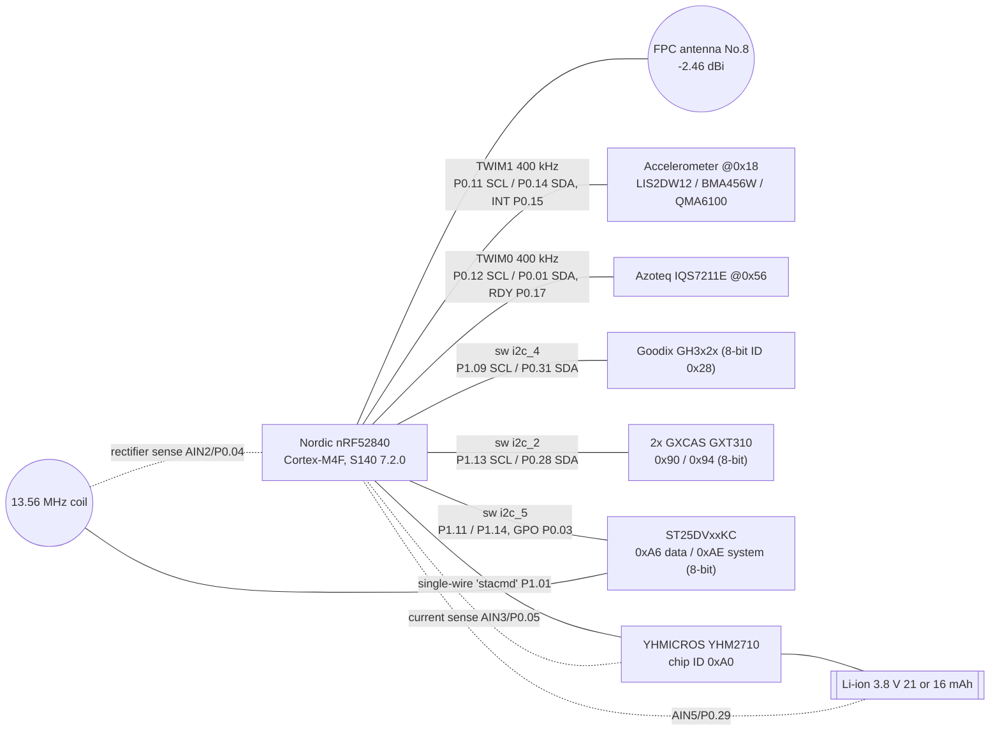

# Even R1 smart ring: hardware

> **Citations.** Repository paths cited as `path` or `path:line` refer to the tree at commit `832137ec`. The 2026-09-29 cleanup retires many of those evidence files; after they are removed, `git show 832137ec:<path>` still shows them.

Tags follow the [confidence vocabulary](README.md#confidence-vocabulary).
Firmware facts come from the analysed stock application **2.2.6.0009**
(646,408 B) and bootloader documented under `r1/`. Pin and bus assignments
were recovered from the stock image; the devicetree files under
`r1/platform/nrf52840/zephyr/boards/openr1/` restate them for the clean-room
openR1 port and are cited as a convenient summary, not as stock source.

The detailed flash map is in [r1/docs/memory-map.md](../../r1/docs/memory-map.md);
a summary is in §7.

## 1. Summary

| Item | Value | Evidence | Tag |
|---|---|---|---|
| MCU | **Nordic nRF52840** (QIAA), Cortex-M4F 64 MHz, 1 MB flash, 256 KB RAM (DS) | `r1/platform/nrf52840/zephyr/boards/openr1/openr1_nrf52840/openr1_nrf52840.dts` (`nrf52840_qiaa.dtsi`); `r1/research/decompilation/application/analysis-summary.json` | FW High |
| Nordic family, independent | Ring exposes Nordic Secure DFU service `0xFE59`, buttonless char `8EC90003-…`, Nordic `crc16_compute` | https://github.com/not-benny/hermes-g2 (`notes/ring-firmware-update-design.md`) | COM |
| SDK / SoftDevice | nRF5 SDK 17.1.0; S140 7.2.0 (FWID 0x0100); app base `0x27000`, app RAM `0x200064A8` | `r1/third-party/fetched/manifest.json`; `r1/docs/correlation/NORDIC-SDK-CORRELATION.md` | FW High |
| RTOS | FreeRTOS 10.5.1 (nRF52 port) + CMSIS-FreeRTOS 10.5.1; tick 1024 Hz; heap_4 | `r1/docs/correlation/FREERTOS-KERNEL-VERSION-CORRELATION.md` | FW High |
| Toolchain | Arm Compiler (armcc/armlink) runtime; exact version not determined | `r1/docs/correlation/TOOLCHAIN-RUNTIME-CORRELATION.md` | FW High |
| Build | Ceramic exterior, stainless-steel interior with PVD coating, epoxy sensor window; sizes 6–15; IP68; 3–4 days per charge | https://support.evenrealities.com/hc/en-us/articles/13500531254159-Specs | Official |
| Sensors (official) | PPG green + IR (HR/HRV), red (SpO2); IMU (steps); NTC for relative skin temperature; LED-based wear detection | same | Official |
| Charging (official) | NFC wireless charging on a magnetic-alignment charger, 20–90 min | same | Official |

Note: the official page says "NTC", while the firmware drives two GXCAS
GXT310 digital temperature sensors (§3). Both may be present, or the
official wording may be generic [INF].

## 2. Block diagram

## 3. Pin and bus map (nRF52840)

| Signal / bus | Pins | Device | Details | Evidence | Tag |
|---|---|---|---|---|---|
| TWIM1 (hardware, stock logical `i2c_1`) | SCL **P0.11**, SDA **P0.14**, 400 kHz | Accelerometer, 7-bit **0x18** | Probe order LIS2DW12 → BMA456W → QMA6100 | `r1/docs/correlation/MOTION-PROVIDER-CORRELATION.md:136`; `r1/README.md:95` | FW High |
| Accelerometer interrupt | **P0.15**, rising, no pull | Accelerometer | GPIOTE IN event | MOTION-PROVIDER-CORRELATION.md:136-140 | FW High |
| TWIM0 (hardware) at `0x40003000` | SCL **P0.12**, SDA **P0.01**, 400 kHz | Azoteq IQS7211E, 7-bit **0x56** | Little-endian register words | `r1/docs/boundaries/IQS7211E-PROVIDER-BOUNDARY.md:84,101-122` | FW High |
| Touch LDO enable | **P0.30** | IQS7211E supply | Output | same | FW High |
| Touch RDY/MCLR | **P0.17**, active-low, bidirectional | IQS7211E | High-to-low event, no pull | same | FW High |
| Software TWI `i2c_2` (state `0x20007400`) | SCL **P1.13**, SDA **P0.28**, delay 1 | 2× GXCAS GXT310 at 8-bit **0x90** (`GXT310X0`) and **0x94** (`GXT310X2`) | Signed big-endian register 0 | `r1/docs/boundaries/SOFTWARE-TWI-PROVIDER-BOUNDARY.md`; `r1/docs/boundaries/NAMED-PERIPHERAL-BOUNDARIES.md` | FW High |
| Software TWI `i2c_3` (`0x20007470`) | SCL **P0.11**, SDA **P0.12**, delay 5 | None (present but dormant) | — | SOFTWARE-TWI-PROVIDER-BOUNDARY.md | FW High |
| Software TWI `i2c_4` (`0x200074E0`) | SCL **P1.09**, SDA **P0.31**, delay 1 | Goodix GH3x2x, 8-bit device ID **0x28** (7-bit 0x14) | 16-bit register addresses | SOFTWARE-TWI-PROVIDER-BOUNDARY.md; `r1/docs/correlation/GOODIX-DEMOCODE-INTEGRATION-CORRELATION.md:58,190` | FW High |
| Goodix INT / emitter / reset | INT **P0.21** (active-low, falling); emitter **P0.10**; reset **P1.04** | GH3x2x | — | `openr1_nrf52840.dts` | FW High |
| Software TWI `i2c_5` (`0x20007550`) | **P1.11** and **P1.14**, delay 1 (delay callback has no effect) | ST25DVxxKC and YHM2710 shared resource | SDA/SCL orientation conflicts between documents (see note) | SOFTWARE-TWI-PROVIDER-BOUNDARY.md; `r1/docs/correlation/ST25DVXXKC-CORRELATION.md:168` | FW High (pins) / conflict on direction |
| NFC GPO | **P0.03**, rising edge, no pull | ST25DVxxKC | Wake/field detect | ST25DVXXKC-CORRELATION.md:168 | FW High |
| NFC / dock board enable | **P1.10** | NFC dock power | Config word `0x0000030F`; low / 10 ticks / high / 10 ticks | `r1/docs/boundaries/YHM2710-I2C5-RESOURCE-BOUNDARY.md:22-23`; `r1/docs/correlation/NFC-DOCK-POLICY-CORRELATION.md` | FW High |
| PMIC single wire | **P1.01** (absolute pin 33) | YHM2710 | See §5 | `r1/docs/correlation/YHM2710-REDUCTION-CORRELATION.md:63-67` | FW High |
| SAADC ch0 `vbat_adc` | AIN5 / **P0.29**, gain 1/2, 0.6 V ref, 40 µs | Battery voltage | 12-bit | `r1/docs/correlation/ANALOG-BATTERY-CORRELATION.md:30-34` | FW High |
| SAADC ch1 `vpmic_isns_adc` | AIN3 / **P0.05**, gain 1/2, 40 µs | PMIC current sense | 12-bit | same | FW High |
| SAADC ch2 `vnfc_rect_adc` | AIN2 / **P0.04**, gain 1/6, 10 µs | NFC rectifier voltage | 12-bit | same | FW High |
| Reset pin | `gpio-as-nreset` in the openR1 devicetree | — | Stock UICR to be confirmed | `openr1_nrf52840.dts` | INF |

Notes:

- **Stock uses software TWI for `i2c_1` and `i2c_5`.** The stock firmware ran
  both the motion bus and the NFC/PMIC bus on GPIO-driven two-wire engines;
  the openR1 port substitutes hardware TWIM1 for both through an arbiter
  (`r1/docs/correlation/ST25DVXXKC-CORRELATION.md:225-236`) [FW]. The motion
  bus (P0.11/P0.14) and the NFC bus (P1.11/P1.14) are separate pin sets; the
  worn (motion) and docked (NFC) contexts are mutually exclusive.
- **i2c_5 pin direction conflict.** The software-TWI boundary lists
  "SDA / SCL = P1.11 / P1.14"; the ST25DVxxKC correlation lists "SCL P1.11,
  SDA P1.14". Resolve from the `i2c_5` open routine at `0x000553E4` before use
  (open question 16).
- Software TWI engines share one callback-vtable framework with the generic
  device registry; read transaction = start / addr / reg / repeated start /
  addr|1 / N bytes / stop; write = addr + 16-bit register MSB-first + one byte
  (SOFTWARE-TWI-PROVIDER-BOUNDARY.md) [FW].

## 4. Sensors

| Part | Function | Bus / address | IDs and notes | Evidence | Tag |
|---|---|---|---|---|---|
| ST LIS2DW12 | Accelerometer, probe 1 | TWIM1 @0x18 | WHO_AM_I 0x44; pid driver v2.1.0 compatible | `r1/third-party/fetched/manifest.json`; MOTION-PROVIDER-CORRELATION.md:54 | FW High (driver) |
| Bosch BMA456(W) | Accelerometer, probe 2 | TWIM1 @0x18 | SensorAPI v2.29.0 (delay_us offset 0x2c discriminator) | same | FW High (driver) |
| QST QMA6100 / QMA6100P | Accelerometer, fallback | TWIM1 @0x18 | Chip ID 0xFA (QMA6100) or 0x9x (QMA6100P); V1.0 lineage | `r1/docs/boundaries/NAMED-PERIPHERAL-BOUNDARIES.md`; `r1/docs/correlation/QMA6100-REDUCTION-CORRELATION.md` | FW High (driver) |
| Which accelerometer is fitted | — | — | Not established; stock supports all three | NAMED-PERIPHERAL-BOUNDARIES.md | open |
| Azoteq IQS7211E | Capacitive touch surface (trackpad controller) | TWIM0 @0x56 | ATI calibration commands | `r1/docs/boundaries/IQS7211E-PROVIDER-BOUNDARY.md` | FW High |
| Goodix GH3x2x | PPG AFE: HR, HRV, SpO2, wear detection (NADT) | sw `i2c_4`, ID 0x28 | gh3x2x-v2.23, democode v1.6, DrvLib v4.3.0.0, Virtual_Reg v3.4; algorithm libraries binary-only | `r1/docs/boundaries/goodix_gh3x2x_candidate-ATTRIBUTION-2026-08.md`; GOODIX-DEMOCODE-INTEGRATION-CORRELATION.md | FW High (family); exact part UNV |
| GXCAS GXT310 ×2 | Digital skin/body temperature | sw `i2c_2`, 0x90 / 0x94 (8-bit) | One-shot and mode-switch diagnostics; register 0, ×0.0078125 °C/LSB | NAMED-PERIPHERAL-BOUNDARIES.md | FW High |
| ST ST25DVxxKC | Dynamic NFC tag with energy harvesting; dock/charger link | sw `i2c_5`, 0xA6 data / 0xAE system (8-bit) | Accepted IC references 0x50 and 0x51; 20-byte mailbox; GPO1 `0x21`; energy-harvesting reset in init | `r1/docs/correlation/ST25DVXXKC-CORRELATION.md` | FW High |

Health algorithms (sleep, energy, stress) run from the GoMore SDK
(362 functions, version unknown) [FW, `r1/docs/boundaries/GOMORE-PROVIDER-BOUNDARY.md`].

## 5. PMIC: YHMICROS YHM2710 single-wire protocol

| Element | Detail | Evidence | Tag |
|---|---|---|---|
| Wire | One GPIO, **P1.01**, used for status and command ("stacmd") | `r1/docs/correlation/YHM2710-REDUCTION-CORRELATION.md:63` | FW High |
| Command acceptance | Command accepted only when bit 6 is set; header `(command & 0xF0) + register` | same:64 | FW High |
| Header | Seven header bits then a read (1) / write (0) selector pulse | same:65 | FW High |
| Data | Eight data bits MSB first; XOR parity over each byte; read responses carry parity after every byte except the last | same:66-67 | FW High |
| Timing | 52-count and 13-count pulse encoding; 209-iteration delay loop; recovery/idle waveforms; bounded edge sampling | same:24; `r1/reconstructed/yhm2710/yhm2710.h` | FW High |
| Identity | Chip ID **0xA0**; exact five-register init sequence | same:25 | FW High |
| Registers used | Reg 1 (bit 1, upper field from an eight-code float ladder), reg 2 (`0x28` / `0xA8` shared-power values, `0xF8`), reg 3 (charging-event mask), reg 6 (high nibble = charge state), reg 9 (one-byte read) | same:26-34 | FW High |
| Vendor description | YHM2710/2: programmable charging, current monitoring and shipping mode for wearables ("Smart Power Management") | `r1/docs/boundaries/NAMED-PERIPHERAL-BOUNDARIES.md`; product listing http://www.yhmicros.com/en/productw.asp?id=44 (title seen in search; the page returned HTTP 503 when opened) | DS (weak) |

The same vendor's single-wire "Access Command (ACMD)" protocol is documented
for the YHM2510 used in the G2 case (see [YHM2510](components/yhm2510.md));
whether YHM2710 "stacmd" is the same protocol is not established [INF].

## 6. NFC charging and radio

| Item | Value | Evidence | Tag |
|---|---|---|---|
| NFC / charging frequency | 13.56 MHz, ASK, 1 channel, induction coil antenna | R1 NFC test report N25080700247E §2.1 (https://fccid.co/fcc/2BFKR-R1) | REG |
| NFC 20 dB bandwidth | 0.753 kHz (as printed) | same, §5.4 | REG |
| NFC field / EIRP | 58.48 dBµV/m; EIRP −36.78 dBm (tune-up −36 ± 1 dBm) | R1 RF exposure exhibit | REG |
| Test setup | Ring + "Smart Ring Charger Even R1" (AE-2) + adapter ADP65S-1903420 (AE-1) | R1 NFC test report §2.4 | REG |
| Power line in report | "Smart Ring Input: AC 5-35V, 1W" (as printed) | same, §2.1 | REG |
| BLE | 2402–2480 MHz, BLE 1 Mbps; FPC antenna −2.46 dBi | R1 RF exposure exhibit | REG |
| BLE conducted power, data set 1 | −6.24 / −5.63 / −5.37 dBm at 2402 / 2440 / 2480 MHz | same | REG |
| BLE conducted power, data set 2 | −6.08 / −5.44 / −5.30 dBm | same | REG |
| BLE tune-up | −6 ± 1 dBm (max −5 dBm = 0.316 mW) | same | REG |
| Simultaneous TX | "The EUT cannot support simultaneous multiple transmissions" (BLE and NFC) | same | REG |
| Antenna | "Antenna FPC (No.8)", material code 63910031, supplier Shenzhen ZTX Communication Technology Co., Ltd.; customer Shenzhen Yiwen Technology Co., Ltd.; acknowledged 2025-09-23 | R1 antenna specification exhibit | REG |
| NFC charge path in firmware | ST25DVxxKC energy-harvesting reset during init; rectifier voltage sensed on AIN2/P0.04; charge-task event bits drive PMIC charge-event policy (`0x5A`) and touch open/close | ST25DVXXKC-CORRELATION.md:160-168; ANALOG-BATTERY-CORRELATION.md; `r1/docs/correlation/NFC-CHARGE-TASK-POLICY-CORRELATION.md:27-34` | FW High |
| Separate wireless-charging receiver IC | Not identified | — | open question 17 |

BLE (firmware):

| Item | Value | Evidence | Tag |
|---|---|---|---|
| Vendor service | Base `BAE8xxxx-4F05-4503-8E65-3AF1F7329D1F`; service `0x0001`; ch1 RX `0x0010` / TX `0x0011`; ch2 RX `0x0012` / TX `0x0013` | `r1/platform/nrf52840/sdk/openr1_bae8.c:20-24,287-290` | FW High |
| DFU | Buttonless DFU `8EC90003-F315-4F60-9FB8-838830DAEA50`; bootloader = nRF5 SDK 17.1.0 BLE Secure DFU (ECDSA-P256/SHA-256), P-256 public key at `0xFD868` | `r1/research/bootloader-reconstruction/README.md`; `r1/docs/correlation/BUTTONLESS-DFU-EVENT-POLICY-CORRELATION.md` | FW High |
| Link parameters | MTU 247; 3 peripheral links; GAP event length 6; 2 vendor UUID bases | `r1/platform/nrf52840/sdk/config/sdk_config.h` | FW High |
| Relationship to G2 | G2 connects to the ring as BLE central (see [g2-glasses.md](g2-glasses.md#4-inter-processor-links)) | `g2/docs/research/g2-ble-ota-ring-profiles-recovery.md` | FW High |

## 7. Batteries

| Item | Value | Evidence | Tag |
|---|---|---|---|
| Cell 1 | JL136235, 3.8 V, 21 mAh, 79.8 mWh | R1 NFC test report §2.1 | REG |
| Cell 2 | JL136228, 3.8 V, 16 mAh, 60.8 mWh | same | REG |
| Interpretation | Two cells for different ring sizes | INF (sizes 6–15 on the official page) | INF |
| Firmware battery model | Four 20-segment discharge/charge curves; ≤2399 mV returns fallback 50 %; 4341 mV + ≥5 full-state refreshes ⇒ 100 % | ANALOG-BATTERY-CORRELATION.md:107-114 | FW High |

## 8. Flash map summary

Full detail: [r1/docs/memory-map.md](../../r1/docs/memory-map.md).

| Range | Content | Evidence | Tag |
|---|---|---|---|
| `0x00000–0x26FFF` | MBR + SoftDevice S140 7.2.0 | `r1/research/decompilation/README.md`; `r1/docs/correlation/INTERNAL-FLASH-CORRELATION.md` | FW High |
| `0x27000–0xC4D07` | Application 2.2.6.0009, 646,408 B (link region to `0xD0FFF`) | same | FW High |
| `0xD1000–0xD3FFF` | FDS / Peer Manager, 3 pages | same | FW High |
| `0xD4000–0xF7FFF` | FAL `device_flash`, 36 pages: kv.bin `+0x0/0x2000`, health.db `+0x2000/0x6000`, sleep.db `+0x8000/0x2000`, pKey.bin `+0xA000/0x1000`, reserve `+0xB000/0xB000`, ep.bin `+0x16000/0x2000`, log.bin `+0x18000/0xC000` | `r1/port/fal_cfg.h`; `r1/src/r1_storage.c:7-15` | FW High |
| `0xF8000–0xFDFFF` | Bootloader (24,420 B logical) | `r1/research/bootloader-reconstruction/MEMORY-MAP.md` | FW High |
| `0xFE000` | MBR params / settings backup | same | FW High |
| `0xFF000` | Bootloader settings | same | FW High |
| UICR | `NRFFW[0]=0xF8000`, `NRFFW[1]=0xFE000` | same | FW High |
| RAM | App RAM origin `0x200064A8`; bootloader `.data` `0x20005978`, MSP `0x2000CFA0` | same | FW High |

## 9. Clocks and timers

FreeRTOS tick 1024 Hz; `sys rtc` service at 8 Hz (RTC prescaler 4095); WDT
enabled, bootloader WDT reload reduced by 3200 ticks with a 150-tick floor;
LF clock source in the openR1 config is RC (stock not confirmed)
[FW, `r1/docs/correlation/CLOCK-PRODUCTION-CORRELATION.md`,
`r1/docs/correlation/WATCHDOG-DEVICE-CORRELATION.md`].
